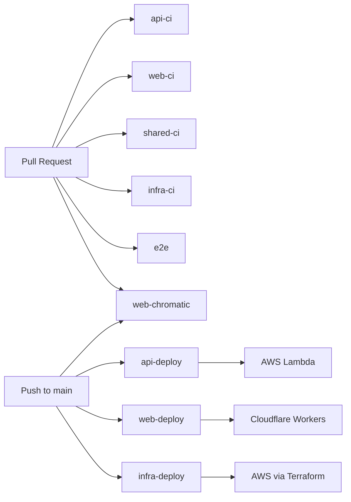

# CI/CD

GitHub Actions runs CI on pull requests and deploys on push to `main`. There is no approval step and no staging or preview environment — `main` goes straight to production.

## Flow

Our deployment flow is [GitHub Flow](https://docs.github.com/en/get-started/using-github/github-flow), which is the simplest branching model. The `main` branch is always deployable, and every change goes through a pull request with CI checks.

```
PR opened → CI runs in parallel → review → merge to main → matching deploy runs
```

## Pipeline



## Workflows

| Workflow      | Trigger           | Role                                                               |
| ------------- | ----------------- | ------------------------------------------------------------------ |
| api-ci        | PR                | Static checks and tests for apps/api                               |
| web-ci        | PR                | Static checks and tests for apps/web                               |
| web-chromatic | PR / Push to main | Visual regression via Chromatic (push to main refreshes baselines) |
| shared-ci     | PR                | Static checks for packages/shared                                  |
| infra-ci      | PR                | Terraform lint / validate / plan (plan is posted as a PR comment)  |
| e2e           | PR                | Playwright end-to-end tests                                        |
| api-deploy    | Push to main      | Push image to ECR and update Lambda                                |
| web-deploy    | Push to main      | Deploy to Cloudflare Workers                                       |
| infra-deploy  | Push to main      | Terraform apply                                                    |

## Deploy Targets

| Target         | Where                                |
| -------------- | ------------------------------------ |
| Web            | Cloudflare Workers (via OpenNext)    |
| API            | AWS Lambda (container image via ECR) |
| Infrastructure | AWS (Terraform apply)                |

## Secrets

- **AWS OIDC role**: managed by Terraform.
- **GitHub Actions secrets**: managed in the GitHub repository Settings.
